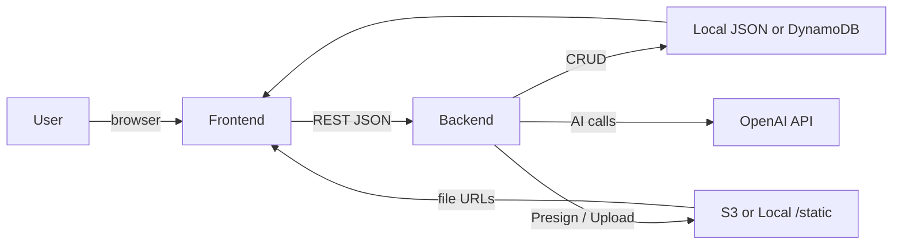

## AI Notes Vault

Full-stack notes app with FastAPI backend and React + Vite frontend. Supports note CRUD, file uploads (local or S3 via presigned URLs), and AI helpers for summarization, OCR, and transcription using OpenAI.

### Tech Stack
- Backend: FastAPI, Pydantic Settings, HTTPX, OpenAI SDK
- Frontend: React, TypeScript, Vite
- Storage: Local filesystem (default) or DynamoDB/S3 (when configured)

### Quick Start
1) Prereqs: Python 3.11+, Node 18+.  
2) Backend
```
cd backend
python -m venv .venv
.venv/Scripts/activate  # or source .venv/bin/activate
pip install -r requirements.txt
cp .env.example .env
# set OPENAI_API_KEY=...
uvicorn app.main:app --reload
```
3) Frontend
```
cd frontend
npm install
npm run dev
```

### Configuration
Backend settings come from environment or `.env`:
- `OPENAI_API_KEY` (required for AI routes)
- `OPENAI_MODEL` (defaults to `gpt-4o-mini`)
- `USE_LOCAL_STORE` (default True). Set False to use DynamoDB/S3.
- `AWS_REGION`, `DYNAMO_TABLE`, `S3_BUCKET` (when remote storage is enabled)
- `ALLOWED_ORIGINS` (CORS whitelist)

### API Overview
- `GET /health` – liveness check.
- Notes (`/notes`): list, create, get, update, delete.
- Storage (`/notes/presign`, `/notes/upload/{key}`): presign S3 uploads; local upload sink when `use_local_store=True`.
- AI (`/ai/summarize`, `/ai/ocr`, `/ai/transcribe`): summarize text, OCR from image URL, transcribe audio URL. Optional `note_id` patches the note with results.

### FastAPI Utilization
- `FastAPI` app with `APIRouter` modules for `notes` and `ai`.
- Dependency injection via `Depends` for settings and repository selection (local vs DynamoDB).
- Pydantic schemas for request/response validation.
- CORS middleware configured from settings.
- Static mount `/static` serves uploaded files when in local mode.

### Data Flow


### Running with Remote Storage (optional)
- Set `USE_LOCAL_STORE=false` and configure AWS creds/roles.
- Notes repository switches to DynamoDB; uploads use S3 presigned URLs.

### Development Notes
- Keep secrets in environment variables; `.gitignore` excludes env/venv/node_modules.
- Frontend dev server runs on `http://localhost:5173`; backend default `http://localhost:8000`.
